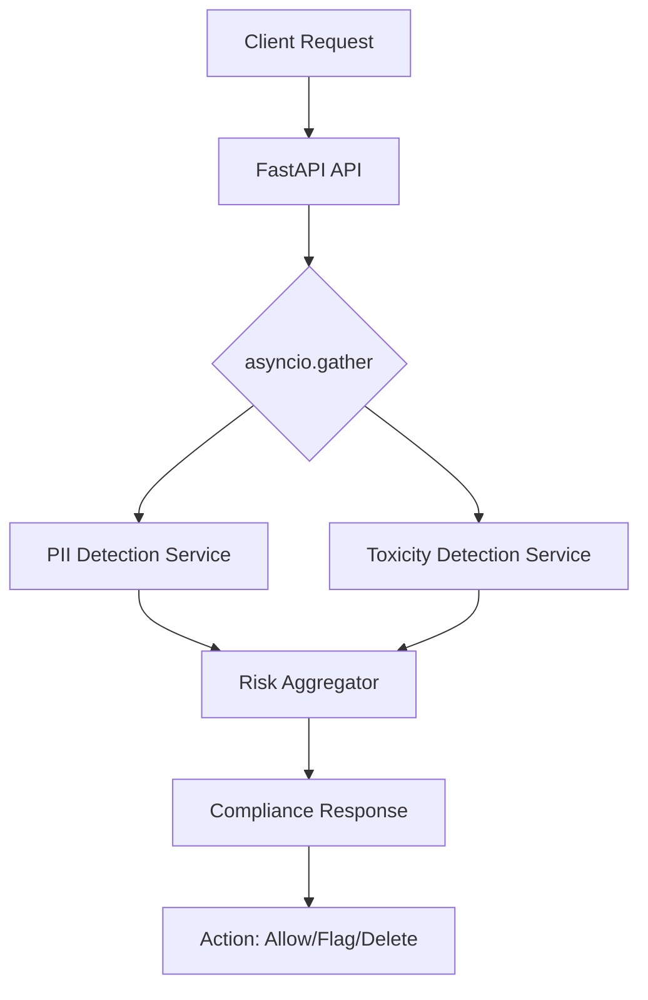

# Workplace Compliance Monitor


Real-time AI monitoring for workplace communications. High-performance compliance gate detecting PII leakage and Toxic behavior using Model-Graded Assessment.

## Architecture



## Prerequisites
- [uv](https://astral.sh/uv)
- `make`
- Docker (optional for containerized execution)

## Usage

### Local Development
```bash
make install # Setup environment
make dev     # Install pre-commit hooks
make test    # Run API & Eval tests
make lint    # Code quality fix
```

### Docker Execution
Run the full suite in an isolated Linux container:
```bash
make up
```

## Example Analysis
**Input:** `"Customer credit card: 4532-1234-5678-9010"`

**Response:**
```json
{
  "final_risk_level": "critical",
  "should_flag": true,
  "recommended_action": "IMMEDIATE ACTION REQUIRED: Delete message..."
}
```

## Development
To contribute and maintain code quality, ensure you run `make dev` to setup the pre-commit guards.

---
**Standard:** Modular Architecture | DeepEval | Async FastAPI
