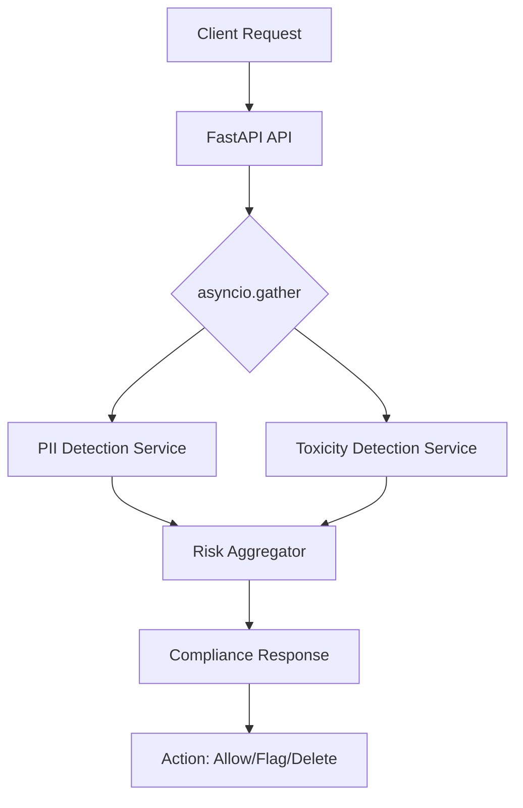

# Workplace Compliance Monitor


Real-time AI monitoring for workplace communications. High-performance compliance gate detecting PII leakage and toxic behavior using Model-Graded Assessment.

## Architecture



## Prerequisites
- uv
- make
- Docker (optional for containerized execution)

## Usage

### Local Development
```bash
make setup    # Install all dependencies
make dev      # Prepare development environment with pre-commit hooks
make test     # Run all API and Evaluation tests
make lint     # Enforce code quality and formatting
```

### Docker Execution
Run the full suite in an isolated Linux container:
```bash
make up
```

### Interactive API Documentation
Once the server is running, explore and test the API directly at:
- Swagger UI: http://localhost:8000/docs

## Scenario Catalog

### Scenario 1: PII Leakage Detection (Critical Risk)
**Request Body:**
```json
{
  "message_text": "Hey team, for the payment, use my card 4532-1234-5678-9010",
  "sender_role": "Customer Service"
}
```

**Response Payload:**
```json
{
  "pii_detection": {
    "has_pii": true,
    "pii_types": ["credit_card"],
    "risk_level": "critical",
    "explanation": "Detected a 16-digit credit card number."
  },
  "toxicity_detection": {
    "is_toxic": false,
    "toxicity_types": [],
    "risk_level": "safe",
    "explanation": "No toxic content found."
  },
  "final_risk_level": "critical",
  "severity_score": 95,
  "recommended_action": "IMMEDIATE ACTION REQUIRED: Delete message and notify security.",
  "should_flag": true,
  "processing_time_ms": 115
}
```

### Scenario 2: Professional Communication (Safe)
**Request Body:**
```json
{
  "message_text": "Could you please send the updated project timeline by end of day?",
  "sender_role": "Management"
}
```

**Response Payload:**
```json
{
  "pii_detection": {
    "has_pii": false,
    "pii_types": [],
    "risk_level": "safe",
    "explanation": "No private data found."
  },
  "toxicity_detection": {
    "is_toxic": false,
    "toxicity_types": [],
    "risk_level": "safe",
    "explanation": "Professional tone detected."
  },
  "final_risk_level": "safe",
  "severity_score": 0,
  "recommended_action": "No Action Required.",
  "should_flag": false,
  "processing_time_ms": 85
}
```

## Development
To contribute and maintain code quality, verify that all changes pass `make lint` and `make test`. Ensure pre-commit hooks are active by running `make dev`.

---
**Standard:** Modular Architecture | DeepEval | Async FastAPI
